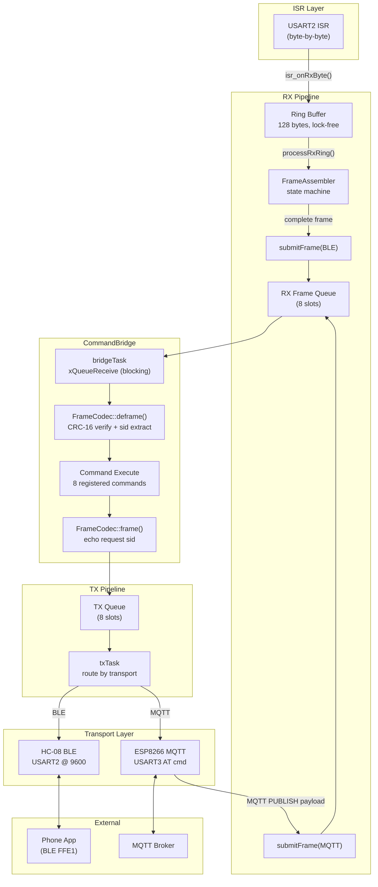

<p align="center">
  
  
  
  
  
</p>

<h1 align="center">Arcana Embedded STM32</h1>

<p align="center">
  <strong>Multi-target embedded platform with MVVM architecture, ArcanaTS time-series database, and Observable pub/sub pattern for STM32 microcontrollers</strong>
</p>

<p align="center">
  <a href="#targets">Targets</a> •
  <a href="#architecture">Architecture</a> •
  <a href="#directory-structure">Structure</a> •
  <a href="#features">Features</a> •
  <a href="#build">Build</a> •
  <a href="#pros--cons">Pros & Cons</a>
</p>

---

## Targets

| Target | MCU | RAM | Flash | Features |
|--------|-----|-----|-------|----------|
| **STM32F051C8** | Cortex-M0, 48MHz | 8KB | 64KB | Observable + Command Pattern + Wire Protocol |
| **STM32F103ZET6** | Cortex-M3, 72MHz | 64KB | 512KB | MVVM LCD + ArcanaTS SD + ECG + BLE + WiFi/MQTT |

### F103 Board: 野火霸道 V2

- 3.2" ILI9341 TFT LCD (240x320, FSMC)
- 32GB SD card (SDIO 4-bit, exFAT)
- ESP8266 WiFi (AT commands, NTP)
- HC-08 BLE 4.0 (USART2, transparent UART via FFE0/FFE1)
- DHT11 temperature, MPU6050 IMU, AP3216C light
- fireDAP CMSIS-DAP debugger

---

## Architecture

### MVVM Pattern (F103)

```
┌─────────────────────────────────────────────────────────┐
│  Controller::wireViews()                                │
│                                                         │
│  // ViewModel ← Service outputs                         │
│  sViewModel.input.SensorData   = SensorService.output   │
│  sViewModel.input.StorageStats = AtsStorage.output      │
│  sViewModel.input.BaseTimer    = TimerService.output    │
│                                                         │
│  // View ← ViewModel + LCD hardware                     │
│  sMainView.input.viewModel = &sViewModel                │
│  sMainView.input.lcd       = &LcdService.getDisplay()   │
└─────────────────────────────────────────────────────────┘
```

**Dependency direction: `View → ViewModel → Service`**

```
┌──────────┐     ┌──────────────┐     ┌─────────────────┐
│  View    │────▶│  ViewModel   │────▶│    Service       │
│ MainView │     │ LcdViewModel │     │ SensorService    │
│          │     │              │     │ TimerService     │
│ render() │◀────│ dirty flags  │◀────│ AtsStorageService│
│ ECG queue│     │ Observable   │     │ SdBenchService   │
│ LCD mutex│     │ callbacks    │     │ WifiService      │
└──────────┘     └──────────────┘     └─────────────────┘
     │                                        │
     ▼                                        ▼
┌──────────┐                          ┌─────────────────┐
│  Driver  │                          │    Common        │
│IDisplay  │◀─Ili9341Display(adapter) │ ChaCha20, Clock  │
│ SdCard   │                          │ DeviceKey, Font  │
└──────────┘                          └─────────────────┘
```

### Observable Pattern (Shared)

```
Service.publish(model)
    │
    ▼
ObservableDispatcher (dual priority queue: 8 normal + 4 high)
    │
    ├──▶ ViewModel.onSensorData()  → dirty |= DIRTY_TEMP
    ├──▶ ViewModel.onBaseTimer()   → dirty |= DIRTY_TIME
    ├──▶ ViewModel.onStorageStats()→ dirty |= DIRTY_STORAGE
    └──▶ ViewModel.onMqttConn()   → dirty |= DIRTY_MQTT
                                          │
                                   xTaskNotifyGive(renderTask)
                                          │
                                          ▼
                                   View.processRender()
```

### CommandBridge (Transport-Agnostic Commands)



#### Frame Reassembly (BLE MTU=20)

HC-08 BLE 4.0 splits frames larger than 20 bytes across multiple UART IDLE events.
`FrameAssembler` is a byte-level state machine that handles both fragmentation and concatenation:

| Problem | Solution |
|---------|----------|
| **Fragmentation** (MTU splits) | State machine accumulates bytes across multiple IDLE events |
| **Concatenation** (multi-frame) | Scans for `0xAC DA` magic, loops to extract all frames |
| **Corruption** (bad CRC) | `FrameCodec::deframe()` rejects, logs `[CMD] Bad frame` |
| **Out-of-order** | Response echoes request `sid` — phone matches by sequence |
| **Backpressure** | Ring buffer drops bytes when full; TX queue drops when full |

#### Registered Commands

| Cluster | ID | Command | Response |
|---------|-----|---------|----------|
| System 0x00 | 0x01 | Ping | tick:4LE |
| System 0x00 | 0x02 | GetFirmwareVersion | `__DATE__` string |
| System 0x00 | 0x03 | GetCompileDateTime | `__DATE__ __TIME__` |
| Device 0x02 | 0x01 | GetDeviceModel | "STM32F103ZE" |
| Device 0x02 | 0x02 | GetSerialNumber | UID 12-byte hex |
| Sensor 0x01 | 0x02 | GetTemperature | temp*10:2LE |
| Sensor 0x01 | 0x03 | GetAccel | ax:2LE ay:2LE az:2LE |
| Sensor 0x01 | 0x04 | GetLight | als:2LE ps:2LE |

Same FrameCodec wire protocol (magic `0xAC DA` + CRC-16) for both transports.
New commands register once in CommandBridge, available on BLE + MQTT simultaneously.

BLE also streams sensor JSON at 1Hz (no framing, plain text):
```
{"t":28.6,"ax":-40,"ay":-1992,"az":17520,"als":682,"ps":78}
```

### Display Abstraction Layer

```
Output (Display)                  Input (Keys)
─────────────                     ──────────────
Controller (wiring)               KEY1(PA0) KEY2(PC13)
     │                                 │
Ili9341Lcd ──► Ili9341Display ──► IDisplay* (g_display)
(HW driver)     (Adapter)              │
                                 ┌─────┴──────────┐
                              MainView          Toast
                           (processRender)   (repaint-on-top)
                                 │
                          WidgetGroup (future)
                        ┌──┬──┬──┬──┐
                     [Btn][Chk][Sld][Rad]...
```

| Component | Location | Purpose |
|-----------|----------|---------|
| `IDisplay` | `Shared/Inc/display/` | Abstract interface — View never sees hardware |
| `Ili9341Display` | `Services/Driver/` | Adapter: delegates to Ili9341Lcd |
| `MutexDisplay` | `Shared/Inc/display/` | Thread-safe decorator (disabled: 88B RAM) |
| `DisplayStatus` | `Shared/Inc/display/` | statusLine() + toast() + headerBar() |
| `Widget` | `Shared/Inc/display/` | Base widget + WidgetGroup + focus navigation |
| `FormWidgets` | `Shared/Inc/display/` | Label, Checkbox, RadioGroup, Slider, ProgressBar |
| `DialogWidgets` | `Shared/Inc/display/` | AlertDialog, ConfirmDialog, Toast |
| `ViewManager` | `Services/View/` | Stack navigation: push/pop + swipe switching |
| `DisplayConfig` | `Shared/Inc/display/` | Feature flags — compile-time on/off (zero cost) |

**Toast: repaint-on-top** — ILI9341 has no hardware layers, MCU has no RAM for framebuffer (240x320x2=150KB > 64KB RAM). Toast redraws every render cycle as the last step in `processRender()`. On dismiss, `onEnter()` + `dirty=0xFF` forces full screen rebuild.

### ArcanaTS v2 (Time-Series Database)

- Cross-platform: PAL interfaces (IFilePort, ICipher, IMutex)
- Multi-channel: up to 8 sensors per .ats file
- 1kHz sustained writes, zero data loss
- ChaCha20 encryption, CRC-32 integrity
- Daily rotation + device.ats lifecycle DB

---

## Directory Structure

### F103 Services (Role-Based MVVM)

```
Targets/stm32f103ze/
├── Services/
│   ├── Controller/     # Controller.hpp/.cpp, F103App.cpp
│   ├── Service/        # Interfaces (contracts)
│   │   ├── ITimerService.hpp, LcdService.hpp, SensorService.hpp
│   │   ├── AtsStorageService.hpp, SdBenchmarkService.hpp
│   │   ├── WifiService.hpp, MqttService.hpp, BleService.hpp, ...
│   │   ├── CommandBridge.hpp         (shared command registry)
│   │   └── impl/      # Implementations
│   │       ├── TimerServiceImpl.hpp/.cpp
│   │       ├── LcdServiceImpl.hpp/.cpp  (HW init only)
│   │       ├── AtsStorageServiceImpl.hpp/.cpp (1kHz TSDB)
│   │       ├── SdBenchmarkServiceImpl.hpp/.cpp (SD mount/format)
│   │       ├── CommandBridge.cpp       (shared command processing)
│   │       ├── BleServiceImpl.hpp/.cpp (HC-08 BLE transport)
│   │       └── Wifi/Mqtt/Led/Light/Sensor/SdStorage ServiceImpl
│   ├── Command/        # Command implementations
│   │   └── Commands.hpp          (header-only: 8 ICommand classes)
│   ├── Driver/         # Hardware abstraction
│   │   ├── Ili9341Lcd.hpp/.cpp     (FSMC LCD)
│   │   ├── SdCard.hpp/.cpp         (SDIO DMA)
│   │   ├── Esp8266.hpp/.cpp        (UART AT)
│   │   ├── Hc08Ble.hpp/.cpp        (BLE 4.0 USART2)
│   │   ├── I2cBus, DhtSensor, Ap3216c, Mpu6050
│   │   ├── SdFalAdapter.hpp/.cpp   (FlashDB FAL)
│   │   └── FatFsFilePort.hpp/.cpp  (ArcanaTS file I/O)
│   ├── Model/          # F103Models.hpp, ServiceTypes.hpp
│   ├── View/           # LcdView.hpp, MainView.hpp/.cpp, ViewManager.hpp
│   ├── ViewModel/      # LcdViewModel.hpp (Input/Output/dirty flags)
│   └── Common/         # ChaCha20, SystemClock, DeviceKey, Font5x7
├── Core/               # HAL init, FreeRTOS config, main.c
├── Drivers/            # STM32F1xx HAL
└── Middlewares/        # FreeRTOS, FatFs (exFAT), FlashDB

Shared/
├── Inc/                # Observable, Models, Crc16, FrameCodec, FrameAssembler
│   ├── ats/            # ArcanaTS headers (ArcanaTsDb, Schema, Types)
│   └── display/        # IDisplay, Widget, FormWidgets, DialogWidgets, Toast
└── Src/                # Observable.cpp, ArcanaTsDb.cpp
```

---

## Features

### F103 Dashboard

| Feature | Detail |
|---------|--------|
| **Display Abstraction** | IDisplay interface, Adapter pattern, feature-flagged Widget system |
| **Toast Overlay** | Centered repaint-on-top, auto-dismiss with full screen rebuild |
| **LCD Dashboard** | Temperature, SD stats, MQTT status (ViewModel dirty), ECG waveform, clock |
| **ECG Waveform** | 250Hz sweep display, synthetic Lead II, 8px margin scaling |
| **SD Storage** | exFAT, auto-format on corruption, 1kHz sustained writes |
| **ArcanaTS** | Daily .ats rotation, device.ats lifecycle, ChaCha20 encrypted |
| **SDIO Recovery** | Proactive reinit every 200 writes + reactive on failure |
| **Event-Driven LCD** | xTaskNotify render (no timer polling), dirty flag optimization |
| **BLE 4.0** | HC-08 transparent UART, sensor JSON streaming + FrameCodec commands |
| **Frame Reassembly** | FrameAssembler state machine handles BLE MTU=20 fragmentation + concatenation |
| **CommandBridge** | RX/TX queue architecture — BLE + MQTT share one command registry, 8 commands |
| **NTP Clock** | ESP8266 UDP NTP, RTC restore from device.ats on boot |

### F103 Build Output

```
   text    data     bss     dec     hex  filename
 111592     192   65320  177104   2b3d0  arcana-embedded-f103.elf
```

| Resource | Used | Total | % |
|----------|------|-------|---|
| Flash | 109KB | 512KB | 21% |
| RAM (bss+data) | 64KB | 64KB | 99% |

---

## Build

### Prerequisites

- [STM32CubeIDE](https://www.st.com/en/development-tools/stm32cubeide.html) 1.13+
- ARM GNU Toolchain 13.3
- OpenOCD 0.12+ (for command-line flash)

### Command Line

```bash
# Build
export PATH="/Applications/STM32CubeIDE.app/.../tools/bin:$PATH"
cd Targets/stm32f103ze/Debug
make -j$(nproc) all

# Flash
openocd -f interface/cmsis-dap.cfg -c "transport select swd" \
  -f target/stm32f1x.cfg -c "program arcana-embedded-f103.elf verify reset exit"

# Monitor serial
python3 read_serial.py    # /dev/tty.usbserial-1120 @ 115200
```

### CubeIDE

1. File → Import → Existing Projects into Workspace
2. Select `Targets/stm32f103ze/`
3. Build: Ctrl+B
4. Flash: F11 (Debug)

---

## Pros & Cons

### Architecture Strengths

| Strength | Detail |
|----------|--------|
| **Correct MVVM direction** | View → ViewModel → Service, Service never touches View |
| **Role-based directories** | Consistent with arcana-android / arcana-ios projects |
| **Event-driven render** | Zero polling, xTaskNotify wakes render task on data change |
| **Observable pub/sub** | Type-safe, dual priority, ISR-safe, async dispatch |
| **Controller wiring** | Explicit wireServices() + wireViews() — all bindings visible |
| **SD self-healing** | Auto-format corrupt FS, 3 retries with SDIO HAL reinit |
| **SDIO proactive reinit** | Every 200 polling writes prevents bus degradation |
| **1kHz zero-fail writes** | ArcanaTS + periodic flush + SDIO recovery = sustained throughput |
| **Display Abstraction** | IDisplay interface + Adapter — swap LCD hardware without changing Views |
| **Feature-flagged Widgets** | 9 headers, compile-time on/off — zero Flash/RAM when disabled |
| **Toast repaint-on-top** | Correct tradeoff for ILI9341 without framebuffer (150KB > 64KB RAM) |
| **MQTT via ViewModel dirty** | Single render task writes LCD — eliminates FSMC race condition |
| **Cross-platform ArcanaTS** | PAL interfaces work on STM32/ESP32/Linux |
| **Shared CommandBridge** | RX/TX queue decoupling — bridgeTask processes, txTask sends, zero blocking |
| **BLE frame reassembly** | Ring buffer (ISR) → FrameAssembler (task) → submitFrame — lock-free pipeline |
| **BLE sensor streaming** | 1Hz JSON push via HC-08 FFE1, phone receives automatically |
| **Static allocation** | No malloc, predictable memory, no fragmentation |

### Known Limitations

| Limitation | Impact | Mitigation Path |
|------------|--------|-----------------|
| **g_mainView global pointer** | ECG push bypasses MVVM (AtsStorage → View) | Add ECG Observable on AtsStorageService.output |
| **ViewModel has FreeRTOS deps** | Not pure platform-independent | Extract callbacks to adapter layer |
| **LcdService nearly empty** | Only initHAL + getLcd, could merge into Driver | Keep for interface consistency |
| **subdir.mk manual sync** | CubeIDE regenerates with old paths on .ioc change | Fixed in .cproject, auto-correct via sed |
| **No unit tests** | All validation via on-board serial debug | Add host-side test with mock PAL |
| **ECG tightly coupled** | AtsStorageService knows about MainView | Route through Observable |
| **Header-only ViewModel** | Large header with Observable + FreeRTOS includes | Split to .hpp/.cpp if compile time grows |
| **Single View** | Only MainView, no navigation | ViewManager ready, add SettingsView when needed |
| **MutexDisplay disabled** | g_display not thread-safe (88B RAM cost) | Enable when RAM budget allows |
| **Toast repaint overhead** | Redraws every render cycle while active | Acceptable for small rect (~200x30px) |
| **Hardcoded 240px** | Toast/StatusLine assume 240 width | Parameterize from IDisplay::width() |
| **printf not migrated** | AtsStorage/SdBench/Wifi/OTA use raw printf | Migrate to ArcanaLog event codes |

### Risk Mitigation

| Risk | Mitigation | Status |
|------|------------|--------|
| SD card corruption | f_mount + f_getfree validation → auto f_mkfs | Done |
| SDIO bus degradation | Proactive reinit every 200 writes | Done |
| Queue overflow | Error callback + overflow stats | Done |
| Power loss data loss | ArcanaTS atomic commit + CRC-32 | Done |
| Memory fragmentation | 100% static allocation | By design |
| LCD tearing | Mutex + dirty flag (only redraw changed) | Done |
| LCD race condition | All LCD writes via single render task (ViewModel dirty) | Done |
| Toast dismiss artifacts | onEnter() + dirty=0xFF full rebuild on expire | Done |

---

## Architecture Score

| Dimension | Score | Notes |
|-----------|-------|-------|
| **Abstraction** | 9/10 | IDisplay interface, Adapter pattern, feature flags — View code never sees hardware |
| **Resource Efficiency** | 9/10 | +1.6KB Flash, +16B RAM for full abstraction. gc-sections strips unused widgets |
| **Extensibility** | 8/10 | Widget system, ViewManager, FormWidgets ready. Feature flags enable incrementally |
| **Cross-Platform** | 8/10 | `Shared/Inc/display/` portable to ESP32/Linux. Only Adapter is target-specific |
| **Thread Safety** | 6/10 | MutexDisplay exists but disabled (88B RAM). MQTT fixed via ViewModel. Other services still direct-write |
| **Compositing** | 5/10 | No hardware layers, no framebuffer. Repaint-on-top is pragmatic but limited |
| **Overall** | **7.5/10** | Solid embedded display abstraction within severe HW constraints (64KB RAM, FSMC direct-write). Correct tradeoffs for ILI9341 without LTDC |

**Key architectural decisions:**
- **Repaint-on-top** over framebuffer — 150KB framebuffer impossible on 64KB RAM
- **Feature flags** over ifdef spaghetti — `DisplayConfig.hpp` controls what compiles
- **ViewModel dirty** over direct LCD writes — eliminates race conditions
- **Toast in render task** over separate timer — single writer = no FSMC conflicts

---

## Roadmap

- [x] Observable Pattern + Command Pattern + Wire Protocol (F051)
- [x] Multi-target mono-repo (F051 + F103)
- [x] 3.2" LCD MVVM dashboard with ECG waveform
- [x] ArcanaTS v2 time-series database (1kHz, ChaCha20)
- [x] SD card auto-format + SDIO self-healing
- [x] Role-based MVVM directory structure
- [x] Proper MVVM wiring (View → ViewModel → Service)
- [x] HC-08 BLE 4.0 driver + sensor JSON streaming
- [x] Shared CommandBridge (BLE + MQTT use same commands)
- [x] BLE frame reassembly + ring buffer + RX/TX queue architecture
- [x] 8 registered commands (System/Device/Sensor clusters)
- [x] Display Abstraction Layer (IDisplay, Adapter, Widgets, Toast, ViewManager)
- [x] MQTT status via ViewModel dirty (eliminates LCD race condition)
- [x] ArcanaTS partial block encryption fix
- [ ] Enable MutexDisplay (needs RAM optimization elsewhere)
- [ ] Migrate all printf → ArcanaLog event codes
- [ ] arcana-android BLE integration (sensor dashboard)
- [ ] Real ADS1298 SPI ECG (replace synthetic LUT)
- [ ] ECG Observable (decouple AtsStorage → View)
- [ ] SettingsView / ChartView (multi-view navigation with ViewManager)
- [ ] XPT2046 touch driver + GestureDetector
- [ ] Host-side unit tests with mock PAL
- [ ] BLE baud upgrade (9600 → 115200 for ECG streaming)

---

## License

This project is licensed under the MIT License - see the [LICENSE](LICENSE) file for details.

---

<p align="center">
  Made with embedded passion for medical-grade IoT
</p>
