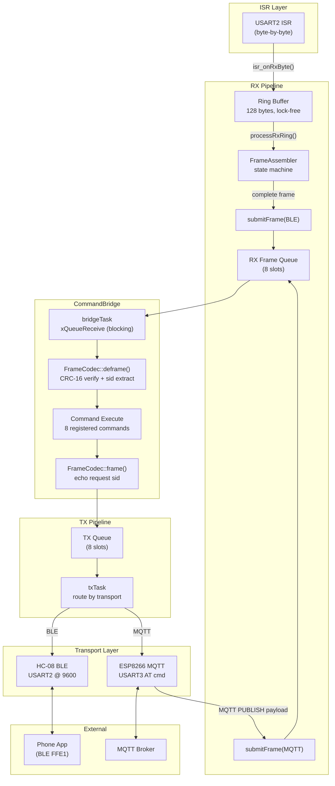

<p align="center">
  
  
  
  
  
  
  
</p>

<h1 align="center">Arcana Embedded STM32</h1>

<p align="center">
  <strong>Multi-target embedded platform with MVVM architecture, ArcanaTS time-series database, and Observable pub/sub pattern for STM32 microcontrollers</strong>
</p>

<p align="center">
  <a href="#targets">Targets</a> •
  <a href="#architecture">Architecture</a> •
  <a href="#directory-structure">Structure</a> •
  <a href="#features">Features</a> •
  <a href="#quality--cicd">Quality</a> •
  <a href="#build">Build</a> •
  <a href="#pros--cons">Pros & Cons</a>
</p>

---

## Targets

| Target | MCU | RAM | Flash | Features |
|--------|-----|-----|-------|----------|
| **STM32F051C8** | Cortex-M0, 48MHz | 8KB | 64KB | Observable + Command Pattern + Wire Protocol |
| **STM32F103ZET6** | Cortex-M3, 72MHz | 64KB | 512KB | MVVM LCD + ArcanaTS SD + ECG + BLE + WiFi/MQTT |

### F103 Board: 野火霸道 V2

- 3.2" ILI9341 TFT LCD (240x320, FSMC)
- 32GB SD card (SDIO 4-bit, exFAT)
- ESP8266 WiFi (AT commands, NTP)
- HC-08 BLE 4.0 (USART2, transparent UART via FFE0/FFE1)
- DHT11 temperature, MPU6050 IMU, AP3216C light
- fireDAP CMSIS-DAP debugger

---

## Architecture

### MVVM Pattern (F103)

```
┌─────────────────────────────────────────────────────────┐
│  Controller::wireViews()                                │
│                                                         │
│  // ViewModel ← Service outputs                         │
│  sViewModel.input.SensorData   = SensorService.output   │
│  sViewModel.input.StorageStats = AtsStorage.output      │
│  sViewModel.input.BaseTimer    = TimerService.output    │
│                                                         │
│  // View ← ViewModel + LCD hardware                     │
│  sMainView.input.viewModel = &sViewModel                │
│  sMainView.input.lcd       = &LcdService.getDisplay()   │
└─────────────────────────────────────────────────────────┘
```

**Dependency direction: `View → ViewModel → Service`**

```
┌──────────┐     ┌──────────────┐     ┌─────────────────┐
│  View    │────▶│  ViewModel   │────▶│    Service       │
│ MainView │     │ LcdViewModel │     │ SensorService    │
│          │     │              │     │ TimerService     │
│ render() │◀────│ dirty flags  │◀────│ AtsStorageService│
│ ECG queue│     │ Observable   │     │ SdBenchService   │
│ LCD mutex│     │ callbacks    │     │ WifiService      │
└──────────┘     └──────────────┘     └─────────────────┘
     │                                        │
     ▼                                        ▼
┌──────────┐                          ┌─────────────────┐
│  Driver  │                          │    Common        │
│IDisplay  │◀─Ili9341Display(adapter) │ ChaCha20, Clock  │
│ SdCard   │                          │ DeviceKey, Font  │
└──────────┘                          └─────────────────┘
```

### Observable Pattern (Shared)

```
Service.publish(model)
    │
    ▼
ObservableDispatcher (dual priority queue: 8 normal + 4 high)
    │
    ├──▶ ViewModel.onSensorData()  → dirty |= DIRTY_TEMP
    ├──▶ ViewModel.onBaseTimer()   → dirty |= DIRTY_TIME
    ├──▶ ViewModel.onStorageStats()→ dirty |= DIRTY_STORAGE
    └──▶ ViewModel.onMqttConn()   → dirty |= DIRTY_MQTT
                                          │
                                   xTaskNotifyGive(renderTask)
                                          │
                                          ▼
                                   View.processRender()
```

### CommandBridge (Transport-Agnostic Commands)



#### Frame Reassembly (BLE MTU=20)

HC-08 BLE 4.0 splits frames larger than 20 bytes across multiple UART IDLE events.
`FrameAssembler` is a byte-level state machine that handles both fragmentation and concatenation:

| Problem | Solution |
|---------|----------|
| **Fragmentation** (MTU splits) | State machine accumulates bytes across multiple IDLE events |
| **Concatenation** (multi-frame) | Scans for `0xAC DA` magic, loops to extract all frames |
| **Corruption** (bad CRC) | `FrameCodec::deframe()` rejects, logs `[CMD] Bad frame` |
| **Out-of-order** | Response echoes request `sid` — phone matches by sequence |
| **Backpressure** | Ring buffer drops bytes when full; TX queue drops when full |

#### Registered Commands

| Cluster | ID | Command | Response |
|---------|-----|---------|----------|
| System 0x00 | 0x01 | Ping | tick:4LE |
| System 0x00 | 0x02 | GetFirmwareVersion | `__DATE__` string |
| System 0x00 | 0x03 | GetCompileDateTime | `__DATE__ __TIME__` |
| Device 0x02 | 0x01 | GetDeviceModel | "STM32F103ZE" |
| Device 0x02 | 0x02 | GetSerialNumber | UID 12-byte hex |
| Sensor 0x01 | 0x02 | GetTemperature | temp*10:2LE |
| Sensor 0x01 | 0x03 | GetAccel | ax:2LE ay:2LE az:2LE |
| Sensor 0x01 | 0x04 | GetLight | als:2LE ps:2LE |

Same FrameCodec wire protocol (magic `0xAC DA` + CRC-16) for both transports.
New commands register once in CommandBridge, available on BLE + MQTT simultaneously.

#### StreamId Routing

| sid | Direction | Meaning |
|-----|-----------|---------|
| `0x00` | RX/TX | Plaintext binary command (backward-compatible) |
| `0x10` | RX/TX | ChaCha20 + HMAC-SHA256 encrypted command |
| `0x20` | TX (push) | ChaCha20 encrypted sensor stream (BleServiceImpl 1Hz) |

BLE sensor push (1Hz, sid=0x20) — ChaCha20 encrypted + FrameCodec, decoded by `tools/ble-sensor-monitor.js`:
```
[FrameCodec: magic=0xAC DA, sid=0x20, len=26]
payload: ChaCha20{ temp:i16 ax:i16 ay:i16 az:i16 als:u16 ps:u16 }
```

### Display Abstraction Layer

```
Output (Display)                  Input (Keys)
─────────────                     ──────────────
Controller (wiring)               KEY1(PA0) KEY2(PC13)
     │                                 │
Ili9341Lcd ──► Ili9341Display ──► IDisplay* (g_display)
(HW driver)     (Adapter)              │
                                 ┌─────┴──────────┐
                              MainView          Toast
                           (processRender)   (repaint-on-top)
                                 │
                          WidgetGroup (future)
                        ┌──┬──┬──┬──┐
                     [Btn][Chk][Sld][Rad]...
```

| Component | Location | Purpose |
|-----------|----------|---------|
| `IDisplay` | `Shared/Inc/display/` | Abstract interface — View never sees hardware |
| `Ili9341Display` | `Services/Driver/` | Adapter: delegates to Ili9341Lcd |
| `MutexDisplay` | `Shared/Inc/display/` | Thread-safe decorator (disabled: 88B RAM) |
| `DisplayStatus` | `Shared/Inc/display/` | statusLine() + toast() + headerBar() |
| `Widget` | `Shared/Inc/display/` | Base widget + WidgetGroup + focus navigation |
| `FormWidgets` | `Shared/Inc/display/` | Label, Checkbox, RadioGroup, Slider, ProgressBar |
| `DialogWidgets` | `Shared/Inc/display/` | AlertDialog, ConfirmDialog, Toast |
| `ViewManager` | `Services/View/` | Stack navigation: push/pop + swipe switching |
| `DisplayConfig` | `Shared/Inc/display/` | Feature flags — compile-time on/off (zero cost) |

**Toast: repaint-on-top** — ILI9341 has no hardware layers, MCU has no RAM for framebuffer (240x320x2=150KB > 64KB RAM). Toast redraws every render cycle as the last step in `processRender()`. On dismiss, `onEnter()` + `dirty=0xFF` forces full screen rebuild.

### ArcanaTS v2 (Time-Series Database)

- Cross-platform: PAL interfaces (IFilePort, ICipher, IMutex)
- Multi-channel: up to 8 sensors per .ats file
- 1kHz sustained writes, zero data loss
- ChaCha20 encryption, CRC-32 integrity
- Daily rotation + device.ats lifecycle DB

---

## Directory Structure

### Layered Architecture (aligned with arcana-embedded-esp32 + arcana-android `app/src/main/`)

Restructured 2026-04-24 ([plan: cheerful-bubbling-moore.md](/Users/jrjohn/.claude/plans/cheerful-bubbling-moore.md)).
Top-level `Main/` is PascalCase to match ST CubeMX siblings (`Core/`, `Drivers/`,
`Middlewares/`); layered subdirs are lowercase per the ESP32/Android convention.

```
Targets/stm32f103ze/
├── Main/                               # Business code (was: Services/)
│   ├── App.cpp                         # extern "C" App_Init/App_Run entry
│   ├── AppContainer.{hpp,cpp}          # DI container, 5-phase lifecycle
│   ├── service/                        # Service pattern: interfaces at root
│   │   ├── ITimerService.hpp, LcdService.hpp, SensorService.hpp, ...
│   │   ├── AtsStorageService.hpp, SdBenchmarkService.hpp
│   │   ├── WifiService.hpp, MqttService.hpp, BleService.hpp
│   │   ├── CommandBridge.hpp           (shared command registry)
│   │   └── impl/                       # Implementations
│   │       ├── TimerServiceImpl, LcdServiceImpl, SensorServiceImpl
│   │       ├── AtsStorageServiceImpl (1kHz TSDB)
│   │       ├── SdBenchmarkServiceImpl (SD mount/format)
│   │       ├── CommandBridgeImpl, BleServiceImpl (HC-08)
│   │       └── Wifi/Mqtt/Led/Light/SdStorage/IoServiceImpl
│   ├── transport/                      # Network adapters (split from driver/)
│   │   ├── ble/     Hc08Ble.{hpp,cpp}  (BLE 4.0 UART AT)
│   │   └── wifi/    Esp8266, EspFlasher (Wi-Fi + firmware flasher)
│   ├── driver/                         # Pure HAL drivers
│   │   ├── Ili9341Lcd (FSMC), SdCard (SDIO DMA)
│   │   ├── I2cBus, DhtSensor, Ap3216cSensor, Mpu6050Sensor
│   │   ├── SdFalAdapter (FlashDB FAL)
│   │   └── FatFsFilePort (ArcanaTS file I/O)
│   ├── command/    Commands.hpp        # 8 ICommand classes, header-only
│   ├── view/                           # MVVM UI
│   │   ├── BaseLcdView.hpp             # base class (was: LcdView.hpp)
│   │   ├── ViewManager.hpp             # stack-based view nav
│   │   └── main/                       # Main screen feature folder
│   │       ├── MainView.{hpp,cpp}
│   │       └── MainViewModel.hpp       # was: LcdViewModel.hpp
│   └── core/                           # Board-specific cross-cutting
│       ├── model/  F103Models.hpp, ServiceTypes.hpp
│       └── (Common/ contents: ChaCha20, SystemClock, DeviceKey, Font5x7,
│               AtsAppender, DeviceAppender, KeyStore, EcgBuffer, ...)
├── Core/                               # CubeMX-generated (main.c, FreeRTOS init)
├── Drivers/                            # STM32F1xx HAL
└── Middlewares/                        # FreeRTOS, FatFs (exFAT), FlashDB

Targets/stm32f051c8/Main/               # F051 parallel layout
├── App.cpp                             # entry (was: controller/App.cpp)
├── service/       CounterService, TimerService, TimeDisplayService
└── command/
    ├── CommandDispatcher, CommandRegistry, CommandService (framework)
    ├── codec/     CommandCodec.{hpp,cpp}
    └── commands/  PingCommand, GetCounterCommand (was: impl/)

Shared/                                 # Cross-target library (.cpp auto-globbed)
├── Inc/
│   ├── App.hpp                         # entry-class header
│   ├── core/                           # Cross-cutting infrastructure
│   │   ├── event/      Observable.hpp, EventCodes.hpp
│   │   ├── log/        Log.hpp (LOG_I/W/E/F macros)
│   │   ├── model/      Models.hpp, ota_header.h
│   │   ├── validation/ Crc16.hpp, Crc32.hpp
│   │   └── types/      types.h
│   ├── command/                        # Command pattern (cross-target)
│   │   ├── ICommand.hpp, CommandTypes.hpp
│   │   ├── codec/      FrameCodec, FrameAssembler, *.pb.h, .proto
│   │   └── security/   CryptoEngine, KeyExchangeManager, Sha256
│   ├── db/arcanats/ats/                # ArcanaTS DB engine
│   │   └── ArcanaTsDb, Schema, Types, ICipher, IFilePort, IMutex
│   ├── view/                           # Display widget framework
│   │   └── IDisplay, Widget, FormWidgets, DialogWidgets, BitmapButton, ...
│   ├── mbedtls/, nanopb/               # 3rd-party (untouched)
│   └── uECC.h, uECC_vli.h              # 3rd-party P-256 ECDH
└── Src/                                # .cpp mirror of Inc/ layered dirs
    ├── core/event/Observable.cpp
    ├── command/{codec,security}/*
    ├── db/arcanats/ats/ArcanaTsDb.cpp
    ├── mbedtls/, nanopb/               # 3rd-party
    └── uECC.c + *.inc                  # 3rd-party
```

---

## Features

### F103 Dashboard

| Feature | Detail |
|---------|--------|
| **Display Abstraction** | IDisplay interface, Adapter pattern, feature-flagged Widget system |
| **Toast Overlay** | Centered repaint-on-top, auto-dismiss with full screen rebuild |
| **LCD Dashboard** | Temperature, SD stats, MQTT status (ViewModel dirty), ECG waveform, clock |
| **ECG Waveform** | 250Hz sweep display, synthetic Lead II, 8px margin scaling |
| **SD Storage** | exFAT, auto-format on corruption, 1kHz sustained writes |
| **ArcanaTS** | Daily .ats rotation, device.ats lifecycle, ChaCha20 encrypted |
| **SDIO Recovery** | Proactive reinit every 200 writes + reactive on failure |
| **Event-Driven LCD** | xTaskNotify render (no timer polling), dirty flag optimization |
| **BLE 4.0** | HC-08 transparent UART, ChaCha20 encrypted sensor push (sid=0x20) + FrameCodec commands |
| **Frame Reassembly** | FrameAssembler state machine handles BLE MTU=20 fragmentation + concatenation |
| **CommandBridge** | RX/TX queue architecture — BLE + MQTT share one command registry + crypto path, 8 commands |
| **NTP Clock** | ESP8266 UDP NTP, RTC restore from device.ats on boot |

### Security Architecture

```
Device                                    Server
  │                                         │
  │ fleet_master (flash)                    │ COMPANY_PRIV (env var)
  │   → device_key (TOFU + BLE PSK)        │
  │                                         │
  │ ═══ Registration (HTTPS, one round-trip) ═══
  │                                         │
  │ uECC P-256 keypair (ephemeral)          │ Derive server_priv from COMPANY_PRIV
  │ POST: device_id + device_key + dev_pub  │ ECDH: shared = srv_priv × dev_pub
  │   ←── srv_pub + ECDSA sig + mqtt creds  │ comm_key = HKDF(shared)
  │ ECDH: shared = dev_priv × srv_pub       │ Store device_pub + count in DB
  │ comm_key = HKDF(shared)                 │
  │ Discard dev_priv (PFS)                  │
  │                                         │
  │ ═══ Communication (no daemon needed) ═══
  │                                         │
  │ MQTT sensor: ChaCha20(comm_key)         │ Client: query DB → derive comm_key
  │ MQTT command: ChaCha20+HMAC(comm_key)   │ (same crypto path as BLE)
  │ BLE: ChaCha20+HMAC(session key)         │
```

| Layer | Protection |
|-------|-----------|
| Transport | TLS/SSL (MQTT 8883, HTTPS registration, OTA, upload) |
| Sensor data | ChaCha20 + comm_key (rotates on re-register) |
| Commands | ChaCha20 + HMAC-SHA256 + session key (BLE and MQTT share identical path) |
| BLE | Session gate — ECDH required before any communication |
| Key exchange | ECDH P-256 via micro-ecc (zero mbedtls, 41B/session, ~600B stack) |
| Server auth | ECDSA signature on server_pub (company private key) |
| Key storage | Device: flash KeyStore (RDP protected). Server: DB has zero secrets |
| Logging | Structured LOG_* macros → Serial + ATS file + Syslog (no operational detail in UDP) |

### F103 Build Output

```
   text    data     bss     dec     hex  filename
 177268     360   65128  242756   3b444  arcana-embedded-f103.elf
```

| Resource | Used | Total | % |
|----------|------|-------|---|
| Flash | 173KB | 512KB | 34% |
| RAM (bss+data) | 64KB | 64KB | 99% |

---

## Quality & CI/CD

### SonarQube Metrics

| Metric | Value |
|--------|-------|
| **Coverage** | 100.0% |
| **Bugs** | 0 |
| **Vulnerabilities** | 0 |
| **Code Smells** | 0 |
| **Duplications** | 0.0% |
| **Lines of Code** | 1.3K (analyzed) |

### Test Suite

15 test executables, Google Test v1.14.0, all running on host (x86/ARM64):

| Test | Covers |
|------|--------|
| test_crc16 | CRC-16/KERMIT (FrameCodec wire protocol) |
| test_crc32 | CRC-32 IEEE 802.3 (ArcanaTS / OTA) |
| test_frame_codec | Frame encode/decode, magic, CRC validation |
| test_frame_assembler | BLE MTU reassembly state machine |
| test_command_codec | Binary command request/response serialization |
| test_registry | Command registration, lookup, capacity |
| test_models | Model base class, TimerModel, CounterModel |
| test_services | CounterService, TimeDisplayService |
| test_dispatcher | CommandDispatcher sync/async, CommandService |
| test_commands | PingCommand, GetCounterCommand |
| test_timer_service | FreeRTOS timer mock, Observable publish |
| test_log | ArcanaLog Logger: ring buffer, appenders, level filtering, ISR path |
| test_ota_header | OTA metadata struct layout, flash constants |
| test_observable | Observable subscribe/unsubscribe/notify, publish variants, Dispatcher |
| test_observable_errors | Queue-null + queue-full error paths, mock-captured lambda dispatch |

### CI/CD Pipeline

```
git push → Jenkins (Docker) → Build (F051+F103) → GTest → lcov → SonarQube
```

- **Build**: Docker multi-target ARM cross-compile (gcc-arm-none-eabi)
- **Test**: GTest on gcc:12, coverage via `--coverage` + lcov
- **Analysis**: sonar-scanner-cli → SonarQube (Cobertura XML)
- **Coverage strategy**: Mock FreeRTOS stubs, controllable queue behavior, mock-captured DispatchItem for RTOS callback lambda coverage

---

## Build

### Prerequisites

- [STM32CubeIDE](https://www.st.com/en/development-tools/stm32cubeide.html) 1.13+
- ARM GNU Toolchain 13.3
- OpenOCD 0.12+ (for command-line flash)

### Command Line

```bash
# Build
export PATH="/Applications/STM32CubeIDE.app/.../tools/bin:$PATH"
cd Targets/stm32f103ze/Debug
make -j$(nproc) all

# Flash
openocd -f interface/cmsis-dap.cfg -c "transport select swd" \
  -f target/stm32f1x.cfg -c "program arcana-embedded-f103.elf verify reset exit"

# Monitor serial
python3 read_serial.py    # /dev/tty.usbserial-1120 @ 115200
```

### CubeIDE

1. File → Import → Existing Projects into Workspace
2. Select `Targets/stm32f103ze/`
3. Build: Ctrl+B
4. Flash: F11 (Debug)

---

## Pros & Cons

### Restructure Trade-offs (2026-04-24)

Pros and cons of collapsing `Services/Controller + Service + Driver + View + ViewModel + Common`
into `Main/{service, transport, driver, view, core, command}` — ranked by impact.

**Pros** (most valuable first):

| # | Pro | Why it matters |
|---|-----|----------------|
| 1 | **Cross-platform navigational parity** | ESP32 `main/` ↔ STM32 `Main/` ↔ Android `app/src/main/`. Devs switching repos find the same tree shape — services, transports, views, core all in the same relative positions. |
| 2 | **Feature folders for views** | `view/main/{MainView, MainViewModel}` co-locates screen + its VM. Future `view/setting/`, `view/history/` slot in identically. Scales to N screens without renaming patterns. |
| 3 | **Transport layer explicit** | `transport/{ble, wifi}` separates network adapters (HC-08, ESP8266 AT-command drivers) from pure HAL (`driver/`). Clearer when a change touches "how we talk to the network" vs "how we talk to silicon". |
| 4 | **Interface vs implementation split** | `service/` holds contracts, `service/impl/` holds implementations. Review diff obviously touches one or the other — contract changes get more scrutiny. |
| 5 | **`Shared/Inc` becomes scannable** | Previously ~15 files flat at `Shared/Inc/`. Now `core/{event,log,model,validation,types}` + `command/{codec,security}` + `db/arcanats/ats` + `view/`. Scoped `-I` paths; bare-leaf includes still work. |
| 6 | **Role-descriptive names** | `F103App.cpp` → `App.cpp`; `Controller` → `AppContainer`; `LcdView` → `BaseLcdView`; `LcdViewModel` → `MainViewModel`. Names describe what things *are*, not what target or legacy layer they came from. |
| 7 | **Easier service addition** | Drop `XxxService.hpp` in `service/`, `XxxServiceImpl.{hpp,cpp}` in `service/impl/`. CMake `GLOB_RECURSE` + `-I${ROOT}/service/impl` pick it up; no CMake edit. |
| 8 | **Binary-stable refactor** | F051 text 23296 → 23300 (+4B alignment), F103 text 225348 → 225344 (−4B alignment). Zero behavior drift; purely organizational. |

**Cons** (most annoying first):

| # | Con | Mitigation |
|---|-----|------------|
| 1 | **Mixed case within one tree** | `Main/` PascalCase (ST convention) vs `main/view/main/` lowercase feature folder. Slightly confusing at first read. | Documented: top-level follows ST, layers follow Android/ESP32 convention. |
| 2 | **CubeIDE needs manual Clean on sync** | `.cproject` `-I` paths updated, but CubeIDE caches `subdir.mk` under `Debug/`. One-time `Project > Clean` required after pulling this change. | Noted in commit message; `Debug/` is `.gitignore`'d and regenerates. |
| 3 | **~20 `-I` paths per `.cproject` config** | Was ~10. Four build configs × two languages × two targets = many lines. | Bare-leaf `#include "X.hpp"` still works; no source churn. Python script in commit history rewrites blocks safely. |
| 4 | **15+ path vars in `Tests/CMakeLists.txt`** | `F103_SVC_ROOT`, `F103_TRANSPORT_BLE`, `SHARED_CORE_EVENT`, etc. More moving parts per new test. | `COMMON_INCS` captures all Shared/Inc subdirs so most tests only need `${COMMON_INCS}` + one target-specific folder. |
| 5 | **CubeMX `.ioc` regen risk** | Re-running CubeMX writes `Core/Src/main.c` which still calls `App_Init/App_Run` — those are now in `Main/App.cpp` (was `Services/Controller/F103App.cpp`). Link still works via `GLOB_RECURSE "Main/*.cpp"`. | If CubeMX ever renames the hooks, re-point `Main/App.cpp`. Covered by `test_app_entry` host-side. |
| 6 | **Divergence from ESP32 exact casing** | ESP32 `main/`, STM32 `Main/`. Cross-repo `grep -r main/` won't match both literally. | Explicit trade accepted for STM32-local consistency (siblings are PascalCase). Semantics identical. |
| 7 | **More config surface per rename** | A single tree rename now touches `CMakeLists.txt` + `Tests/CMakeLists.txt` + 2×`.cproject` (4 configs each) + `sonar-project.properties`. | Fewer renames expected now that the target shape is set. Python/perl one-liners handle bulk edits. |

Firmware was rebuilt clean between every phase; all 42 host tests stayed green end-to-end.

### Architecture Strengths

| Strength | Detail |
|----------|--------|
| **Correct MVVM direction** | View → ViewModel → Service, Service never touches View |
| **Role-based directories** | Consistent with arcana-android / arcana-ios projects |
| **Event-driven render** | Zero polling, xTaskNotify wakes render task on data change |
| **Observable pub/sub** | Type-safe, dual priority, ISR-safe, async dispatch |
| **AppContainer wiring** | Explicit wireServices() + wireViews() in `Main/AppContainer.cpp` — all bindings visible |
| **SD self-healing** | Auto-format corrupt FS, 3 retries with SDIO HAL reinit |
| **SDIO proactive reinit** | Every 200 polling writes prevents bus degradation |
| **1kHz zero-fail writes** | ArcanaTS + periodic flush + SDIO recovery = sustained throughput |
| **Display Abstraction** | IDisplay interface + Adapter — swap LCD hardware without changing Views |
| **Feature-flagged Widgets** | 9 headers, compile-time on/off — zero Flash/RAM when disabled |
| **Toast repaint-on-top** | Correct tradeoff for ILI9341 without framebuffer (150KB > 64KB RAM) |
| **MQTT via ViewModel dirty** | Single render task writes LCD — eliminates FSMC race condition |
| **Cross-platform ArcanaTS** | PAL interfaces work on STM32/ESP32/Linux |
| **Shared CommandBridge** | RX/TX queue decoupling — bridgeTask processes, txTask sends, zero blocking |
| **BLE frame reassembly** | Ring buffer (ISR) → FrameAssembler (task) → submitFrame — lock-free pipeline |
| **BLE sensor push encrypted** | 1Hz ChaCha20+FrameCodec (sid=0x20) via HC-08, decoded by ble-sensor-monitor.js |
| **Unified BLE/MQTT crypto** | Zero mbedtls — uECC+ChaCha20+HMAC-SHA256, 41B/session, same path for both transports |
| **ECG decoupled (EcgSampleCallback)** | AtsStorageService → callback → Controller → View, no cross-layer import |
| **Static allocation** | No malloc, predictable memory, no fragmentation |
| **Registration-embedded ECDH** | Key exchange in one HTTP round-trip, no runtime daemon needed |
| **PFS (Perfect Forward Secrecy)** | Ephemeral device keypair discarded after registration |
| **DB has zero secrets** | Only device_pub + count stored; comm_key derived on-the-fly from COMPANY_PRIV |
| **BLE session gate** | ECDH required before any BLE communication (same entry point as MQTT) |
| **Structured logging** | All 111 printf migrated to LOG_* event codes — flows to Serial/ATS/Syslog |
| **TLS everywhere** | MQTT, registration, OTA, upload all use SSL/TLS |
| **micro-ecc (uECC)** | Lightweight P-256 ECDH (~600B stack vs mbedtls ~1.5KB) — fits in MQTT task |

### Known Limitations

| Limitation | Impact | Mitigation Path |
|------------|--------|-----------------|
| **ViewModel has FreeRTOS deps** | Not pure platform-independent | Extract callbacks to adapter layer |
| **LcdService nearly empty** | Only initHAL + getLcd, could merge into Driver | Keep for interface consistency |
| **subdir.mk manual sync** | CubeIDE regenerates with old paths on .ioc change | Fixed in .cproject, auto-correct via sed |
| **F103 services not unit-tested** | F103 drivers/services depend on HAL, tested on-board | Expand mock HAL for host-side testing |
| ~~**ECG tightly coupled**~~ | ~~AtsStorageService knows about MainView~~ | **RESOLVED** — EcgSampleCallback (aa89b72) |
| **Header-only ViewModel** | Large header with Observable + FreeRTOS includes | Split to .hpp/.cpp if compile time grows |
| **Single View** | Only MainView, no navigation | ViewManager ready, add SettingsView when needed |
| **MutexDisplay disabled** | g_display not thread-safe (88B RAM cost) | Enable when RAM budget allows |
| **Toast repaint overhead** | Redraws every render cycle while active | Acceptable for small rect (~200x30px) |
| **Hardcoded 240px** | Toast/StatusLine assume 240 width | Parameterize from IDisplay::width() |
| **COMPANY_PRIV is single root secret** | If leaked + DB breached = all devices compromised | HSM / multi-key per customer / monitoring |
| **comm_key lifetime** | Valid until re-register (no auto-expiry) | Add expires_in enforcement + periodic re-register |
| **Non-standard protocol** | Custom ECDH+ECDSA+ChaCha20, not OAuth/mTLS/X.509 | Document thoroughly, security audit |
| **Syslog UDP unencrypted** | Event codes only (no params), but still visible | Migrate to MQTT publish or TLS syslog |

### Risk Mitigation

| Risk | Mitigation | Status |
|------|------------|--------|
| SD card corruption | f_mount + f_getfree validation → auto f_mkfs | Done |
| SDIO bus degradation | Proactive reinit every 200 writes | Done |
| Queue overflow | Error callback + overflow stats | Done |
| Power loss data loss | ArcanaTS atomic commit + CRC-32 | Done |
| Memory fragmentation | 100% static allocation | By design |
| LCD tearing | Mutex + dirty flag (only redraw changed) | Done |
| LCD race condition | All LCD writes via single render task (ViewModel dirty) | Done |
| Toast dismiss artifacts | onEnter() + dirty=0xFF full rebuild on expire | Done |

---

## Architecture Score

Scores reassessed 2026-04-24 after the Services → Main layered restructure and
a re-audit of Thread Safety (bumped after recognizing the single-writer
render-task discipline is effectively race-free in practice; the MutexDisplay
penalty was over-weighted). Other dimensions untouched by the rename.

| Dimension | Score | Δ | Notes |
|-----------|-------|---|-------|
| **Abstraction** | 9/10 | — | IDisplay interface, Adapter pattern, feature flags — View code never sees hardware |
| **Resource Efficiency** | 9/10 | — | +1.6KB Flash, +16B RAM for full abstraction. gc-sections strips unused widgets. Restructure is binary-neutral (±4B alignment noise) |
| **Extensibility** | 9/10 | **+1** | Feature-folder views (`view/main/`, future `view/setting/`, `view/history/`), `service/` + `service/impl/` split, `transport/` pulls network adapters out of HAL. New screens/services/transports slot in without pattern changes |
| **Cross-Platform** | 9/10 | **+1** | `Shared/Inc/{core,command,db,view}/` layered identically across STM32 targets. `Main/` shape mirrors ESP32 `main/` and Android `app/src/main/` — same service/transport/view/core vocabulary in every repo |
| **Thread Safety** | 8/10 | **+1** | All LCD writes serialize through a single render task (ViewModel dirty); I2C/UART/SDIO each have a dedicated bus mutex or owner task; Observable dispatcher is ISR-safe with dual-priority queues; 100% static allocation. Penalty: MutexDisplay disabled (88B RAM saved) so ad-hoc `g_display` callers (statusLine, headerBar) rely on render-task convergence rather than explicit locking |
| **Compositing** | 5/10 | — | Hardware ceiling on F103: no LTDC, no DMA2D, 64KB RAM can't fit a 150KB framebuffer. Repaint-on-top is the only option; Toast dismiss triggers full MainView rebuild (no restore buffer). Same architecture on STM32H7+LTDC+DMA2D would score ~9 |
| **Code Organization** | 9/10 | **NEW** | Layered by role (service, transport, driver, view, core, command), interface-first (`service/` + `service/impl/`), feature-folder views. Shared `Inc/` no longer flat — `core/ command/ db/ view/` are scannable. See [Restructure Trade-offs](#restructure-trade-offs-2026-04-24) |
| **Overall** | **8.3/10** | +0.5 | Average of 7 dimensions. Solid embedded architecture within severe HW constraints (64KB RAM, FSMC direct-write); correct tradeoffs for ILI9341 without LTDC. Compositing score is HW-bound, not an implementation gap |

**Key architectural decisions:**
- **Layered by role** (`service/`, `transport/`, `driver/`, `view/`, `core/`) — same shape on STM32/ESP32/Android, moving between repos is free
- **Repaint-on-top** over framebuffer — 150KB framebuffer impossible on 64KB RAM
- **Feature flags** over ifdef spaghetti — `DisplayConfig.hpp` controls what compiles
- **ViewModel dirty** over direct LCD writes — eliminates race conditions
- **Toast in render task** over separate timer — single writer = no FSMC conflicts

---

## Roadmap

- [x] Observable Pattern + Command Pattern + Wire Protocol (F051)
- [x] Multi-target mono-repo (F051 + F103)
- [x] 3.2" LCD MVVM dashboard with ECG waveform
- [x] ArcanaTS v2 time-series database (1kHz, ChaCha20)
- [x] SD card auto-format + SDIO self-healing
- [x] Role-based MVVM directory structure
- [x] Proper MVVM wiring (View → ViewModel → Service)
- [x] HC-08 BLE 4.0 driver + sensor JSON streaming
- [x] Shared CommandBridge (BLE + MQTT use same commands)
- [x] BLE frame reassembly + ring buffer + RX/TX queue architecture
- [x] 8 registered commands (System/Device/Sensor clusters)
- [x] Display Abstraction Layer (IDisplay, Adapter, Widgets, Toast, ViewManager)
- [x] MQTT status via ViewModel dirty (eliminates LCD race condition)
- [x] ArcanaTS partial block encryption fix
- [x] Migrate all printf → ArcanaLog structured event codes (111 → 0)
- [x] BLE session gate (ECDH required before communication)
- [x] TLS everywhere (OTA, upload, registration)
- [x] Registration-embedded ECDH key exchange (micro-ecc uECC P-256)
- [x] ECDSA server authentication (company private key signing)
- [x] Server device_token table (key rotation on re-register)
- [x] Syslog info leak mitigation (event codes only, no params)
- [x] ECG decoupled via EcgSampleCallback (Service → callback → Controller → View)
- [x] BLE sensor push encrypted (ChaCha20 FrameCodec sid=0x20, replaces plain JSON)
- [x] Unified BLE/MQTT crypto (zero mbedtls — uECC+ChaCha20+HMAC-SHA256, 41B/session)
- [x] Node.js BLE test tools (ble-cmd-test, ble-sensor-monitor)
- [x] Upgrade C++ standard to C++20
- [ ] Enable MutexDisplay (needs RAM optimization elsewhere)
- [ ] Device-side ECDSA verification (currently server-side only, needs more stack)
- [ ] arcana-android BLE integration (sensor dashboard)
- [ ] Real ADS1298 SPI ECG (replace synthetic LUT)
- [ ] ECG Observable on AtsStorageService.output (full pub/sub decoupling)
- [ ] SettingsView / ChartView (multi-view navigation with ViewManager)
- [ ] XPT2046 touch driver + GestureDetector
- [x] Host-side unit tests (15 suites, 100% coverage, Jenkins CI/CD + SonarQube)
- [ ] BLE baud upgrade (9600 → 115200 for ECG streaming)
- [ ] Multi-key COMPANY_PRIV (per-customer isolation)
- [ ] comm_key auto-expiry + periodic re-register

---

## License

This project is licensed under the MIT License - see the [LICENSE](LICENSE) file for details.

---

<p align="center">
  Made with embedded passion for medical-grade IoT
</p>
